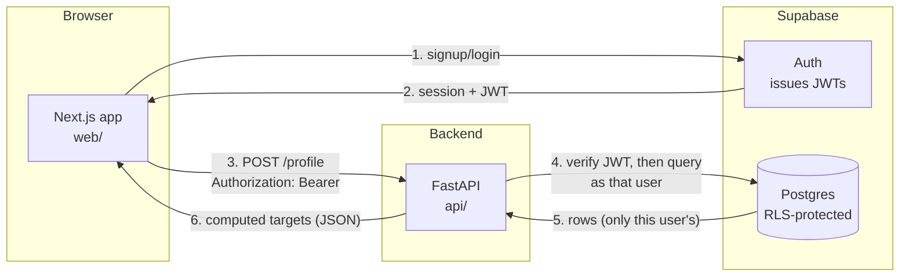

# How TruPlate AI Works — a walkthrough for a beginner

This document explains what's actually been built so far (Phase 0 of 5 — see
[project-plan.md](project-plan.md) for the full roadmap), how the pieces fit
together, and every real bug we hit while building it and why it happened.
It's written for someone who can code but hasn't necessarily used Next.js,
FastAPI, or Supabase before — new concepts are explained the first time they
show up.

If you only read one section, read **"System architecture"** and **"Setbacks
and bugs we actually hit"** — the second one is the part interviewers care
about, because anyone can show a diagram, but explaining *why* something
broke and how you found the real cause is the actual signal.

---

## 1. What this project is

TruPlate AI is a nutrition tracker. The pitch: take a photo of your meal, an
AI figures out what's on the plate, and a real nutrition database (not the AI
guessing) supplies the calorie and macro numbers. Two AI assistants ("Coach"
and "Foodie") will eventually give advice based on your actual logged
history.

**What exists right now (Phase 0):** accounts, login, an onboarding wizard
that computes your personalized calorie/protein targets, and a dashboard that
shows them. There is no photo analysis yet — that's Phase 1, the next thing
to be built. Phase 0's whole job was to prove the foundation works end to
end: a user can sign up, answer some questions, and see a number that was
computed *for them*, and that number is still there the next time they log
in.

---

## 2. System architecture

Three pieces, each with one job:

- **[web/](../web/)** — Next.js. Renders pages, collects input, talks to
  Supabase directly for login/signup (that's allowed — it's not a secret),
  and talks to FastAPI for anything involving real computation or data.
- **[api/](../api/)** — FastAPI. The *only* place that holds secret API keys
  (Gemini, USDA, Supabase's service key) and the *only* place that runs
  business logic (the targets formula, later: the AI pipeline). Nothing in
  the browser ever sees a secret key — see §5.
- **Supabase** — hosted Postgres database plus an auth service. It issues
  **JWTs** (JSON Web Tokens — a signed blob proving "this request really is
  from user X," so the backend doesn't need its own login system) and
  enforces **Row Level Security**, explained in §5.

This is a fairly standard three-tier web app shape. The one TruPlate-specific
rule (from [CLAUDE.md](../CLAUDE.md)) is: **the frontend never calls Gemini or
USDA directly.** Every AI or nutrition-data call is proxied through FastAPI,
because that's the only place API keys live. This matters later — Phase 1's
photo analysis has to be a `POST /analyze` call to FastAPI, not a client-side
Gemini SDK call, even though the client-side call would be less code.

---

## 3. Walkthrough: what happens when someone uses the app today

### Sign up
[web/app/signup/page.tsx](../web/app/signup/page.tsx) calls
`supabase.auth.signUp(email, password)` directly from the browser using
[web/lib/supabase/client.ts](../web/lib/supabase/client.ts). Supabase creates
the account and (once you're logged in) hands back a **session** — an access
token (the JWT) plus a refresh token, stored in cookies by the
`@supabase/ssr` library. On success, the page redirects to `/onboarding`.

### The onboarding wizard
[web/app/onboarding/page.tsx](../web/app/onboarding/page.tsx) is a 4-step
form (goal → rate → activity → stats), each step a small function in the
same file (`GoalStep`, `RateStep`, `ActivityStep`, `StatsStep` — no separate
files, because they're small and only ever used here; splitting them out
would just be extra navigation for no benefit). State lives in one
`OnboardingState` object defined in
[web/app/onboarding/types.ts](../web/app/onboarding/types.ts), updated
through a single generic `update(key, value)` function instead of one
`setX` per field.

Two things worth understanding here:

- **Units are a display-only concern.** The app always *stores* height in cm
  and weight in kg (because that's what the Mifflin-St Jeor formula in the
  backend expects), but the UI lets you type feet/inches or pounds. The
  conversion lives in one small file,
  [web/lib/units.ts](../web/lib/units.ts), and the wizard just converts on
  the way in and out of the input field. This is the general pattern for
  "the backend wants X, the user wants to type Y": convert at the UI edge,
  keep one canonical unit everywhere else.
- **Cuisines and exclusions use the same reusable component**,
  [web/app/onboarding/ChipGroup.tsx](../web/app/onboarding/ChipGroup.tsx): a
  row of toggle buttons plus a "+ Custom" button that reveals a text input.
  Typed custom entries (e.g. an allergy not in the preset list) go into the
  same array that gets sent to the backend — so a custom exclusion is not
  just a UI label, it actually reaches the AI prompt once Phase 1 exists.

On the last step, `submit()` POSTs the whole state as JSON to
`${NEXT_PUBLIC_API_URL}/profile` with `Authorization: Bearer <access_token>`,
and redirects to `/dashboard` on success.

### The backend: turning a profile into targets
[api/main.py](../api/main.py) is the entire FastAPI app — one file, because
right now it's genuinely small (two routes). `POST /profile` and
`GET /profile` both depend on
[api/deps.py](../api/deps.py)'s `get_current_user_client`, which:

1. Reads the `Authorization: Bearer <token>` header.
2. Asks Supabase "is this token real, and whose is it?" via
   `client.auth.get_user(token)`.
3. Returns a Postgres client that's been told to act *as that user*
   (`client.postgrest.auth(token)`) — not as an all-powerful admin client.

That last point is the important one: **the backend deliberately gives up
its own power and queries the database as the logged-in user**, so Row Level
Security (§5) is a real backstop, not just decoration.

The actual math lives in [api/targets.py](../api/targets.py) — pure
functions, no database, no HTTP, nothing async. `calculate_targets()` runs
the Mifflin-St Jeor equation to get BMR (Basal Metabolic Rate — roughly, the
calories your body burns just existing), multiplies by an activity factor to
get TDEE (Total Daily Energy Expenditure — calories burned including
movement), then adds or subtracts calories based on the goal and pace
(±500 kcal/day ≈ ±1 lb/week, since a pound of fat is about 3500 kcal). This
file was built with **TDD** (test-driven development: write a failing test
first, then write the minimum code to pass it) — see
[api/tests/test_targets.py](../api/tests/test_targets.py), 7 tests covering
BMR for both sexes, the activity multiplier, both goal directions, protein
scaling, and the safe-rate cap (see §6, "the two wrong test numbers," for
a bug this actually caught).

`POST /profile` calls `calculate_targets()` and also **upserts** the raw
inputs into the `profiles` table (so they're there next time the user logs
in) — `upsert` meaning insert-or-update, so calling it twice doesn't create
a duplicate row.

### The dashboard
[web/app/dashboard/page.tsx](../web/app/dashboard/page.tsx) loads on mount,
checks for a session, calls `GET /profile`, and renders whatever the backend
computed. Three states beyond "loading": `no-profile` (new user who hasn't
finished onboarding — sent to `/dashboard` directly would otherwise just
crash or show garbage), `error`, and `ready`. The nav bar at the bottom shows
all five planned sections (Today/Log/Coach/Foodie/Profile) but only "Today"
is a real link — the rest are visibly dimmed. That's deliberate: it's honest
about what's built instead of implying features exist that don't (see
[CLAUDE.md](../CLAUDE.md)'s "errors are handled visibly" rule, applied here
to *missing* features too).

---

## 4. The database

One table exists so far,
[supabase/migrations/0001_profiles.sql](../supabase/migrations/0001_profiles.sql):
`profiles`, one row per user, with a `check` constraint on `goal`,
`activity_level`, and `sex` (Postgres rejects the insert at the database
level if you send a value outside the allowed set — a cheap extra
guarantee beyond whatever the API already validates). `cuisines` and
`exclusions` are Postgres text arrays (`text[]`), so a user's custom
"no cilantro" entry is just another string in the array, no separate table
needed.

---

## 5. Security: JWTs and Row Level Security, explained

This is the section that maps directly to the "March 2026 Cal AI breach"
story in [project-plan.md](../project-plan.md) — 3.2 million user records
leaked because a competitor's backend had no real per-user access control.
The mitigation here is two independent layers:

**Layer 1 — JWT verification.** Every request to a protected route must
carry a bearer token. FastAPI asks Supabase to verify it's real before doing
anything else ([api/deps.py](../api/deps.py)). A forged or expired token
gets a 401, immediately.

**Layer 2 — Row Level Security (RLS).** This is a Postgres feature, not
something the app code enforces — it's a policy attached to the *table
itself* (see the `create policy` lines in the migration file). Even if the
API code had a bug that forgot to filter `WHERE user_id = X`, Postgres would
still refuse to return another user's row, because the policy
`using (auth.uid() = user_id)` is checked by the database on every query.
The reason this only works as a real backstop is the point made above: the
backend queries *as the user* (via their JWT), not as an admin — an admin
connection bypasses RLS entirely, which would silently defeat the whole
protection.

---

## 6. Setbacks and bugs we actually hit

Everything below was found by actually running the app — signing up in a
real browser, hitting real endpoints, reading real error messages — not by
just getting the code to typecheck. Several of these would not have been
caught by types or by unit tests alone.

### `gym_days` silently discarded on every save
**Symptom:** users could set their training days in the wizard, but the
value was never in the database. **Root cause:** the FastAPI request model
(`ProfileIn` in [api/main.py](../api/main.py)) never declared a `gym_days`
field, and `create_profile` had `"gym_days": 0` hardcoded in the insert.
Pydantic (FastAPI's request-validation library) **silently drops any field
it doesn't recognize** — it doesn't error, it just ignores it. That's the
real lesson: an undeclared field isn't a loud failure, it's a silent one,
so this kind of bug won't show up in a typecheck or even in a quick manual
test unless you specifically go check the database afterward. Fixed by
declaring the field and using the real value in the insert.

### Two wrong expected values in the targets tests
While writing [api/tests/test_targets.py](../api/tests/test_targets.py),
two tests (`test_gain_goal_adds_kcal_per_rate` and
`test_lose_goal_subtracts_kcal_per_rate`) had their expected numbers
computed from raw BMR instead of TDEE (BMR × activity multiplier). Because
TDD means writing the test *before* the implementation, this was caught
immediately when the "failing" test turned out to be failing for the wrong
reason — the implementation was right and the test's expected number was
wrong. Fixed by correcting the literals to include the activity multiplier.

### Environment variables read before they were loaded
**Symptom:** the API crashed on startup with a `KeyError` for
`SUPABASE_URL`, even though it was in `.env`. **Root cause:**
[api/deps.py](../api/deps.py) reads environment variables at *import* time
(`SUPABASE_URL = os.environ["SUPABASE_URL"]` at module level), but
[api/main.py](../api/main.py) was importing `deps` *before* calling
`load_dotenv()`. Python runs module-level code the moment a file is
imported, so the order of `import` statements matters here. Fixed by
reordering `main.py` so `load_dotenv()` runs first.

### pytest tried to run a sanity script as a test
[api/scripts/test_gemini.py](../api/scripts/test_gemini.py) is a manual
sanity-check script (call Gemini once, print the result), not an automated
test — but its filename matches pytest's default `test_*.py` discovery
pattern, so `pytest` tried to run it and crashed on a missing photo file.
Fixed with [api/pytest.ini](../api/pytest.ini) (`testpaths = tests`), which
tells pytest to only look in the `tests/` folder.

### `test_meal.jpg` path resolved against the wrong directory
Related bug in the same script: it opened `"test_meal.jpg"` as a relative
path, which only works if you happen to run the script from inside
`api/scripts/`. Running it from anywhere else (e.g. the project root, or
`api/`) raised `FileNotFoundError`. Fixed with
`Path(__file__).parent / "test_meal.jpg"`, which resolves relative to the
*script's own location* regardless of the current working directory — a
general pattern worth knowing, since "works on my machine, breaks from a
different folder" is a very common bug shape.

### Two "CORS error" reports that weren't actually CORS problems
Twice during testing, the browser reported a CORS failure — once when
visiting the dashboard before finishing onboarding (a 404 case), once after
a stale session (a 401 case). **Neither was actually a CORS misconfiguration.**
The real cause: an *unhandled* Python exception (`postgrest.exceptions.APIError`
for "no row found," `supabase_auth.errors.AuthApiError` for "bad token")
was escaping the route function entirely. FastAPI's CORS middleware only
attaches CORS headers to responses it gets to handle; an unhandled exception
gets turned into a generic 500 by a different layer (Starlette's error
handler) that sits *outside* the CORS middleware, so that response has no
CORS headers at all — and a response with no CORS headers is exactly what
the browser shows as a CORS error, even though the real problem is a
missing `try/except`. Fixed by catching both exceptions and raising proper
`HTTPException`s in [api/main.py](../api/main.py) and
[api/deps.py](../api/deps.py). **The lesson:** "CORS error" in the browser
console is often a red herring — check what status code and body the server
actually sent before assuming it's a CORS config problem.

### A real race condition on logout → login
[web/app/dashboard/page.tsx](../web/app/dashboard/page.tsx)'s data loading
is a `useEffect` that does several `await`s in a row (get session, then
fetch `/profile`). If a user logs out and back in fast enough, an *old*
in-flight fetch from the previous page load could resolve *after* the new
one and overwrite the dashboard with stale data. This is a genuine
concurrency bug, not a typo — React doesn't cancel in-flight promises when
a component re-renders. Fixed with the standard pattern: a `cancelled`
boolean set to `true` in the effect's cleanup function, checked before every
`setState` call, so a late-arriving response from an old load is simply
ignored.

### Next.js 16 renamed Middleware to Proxy
Training data (and most tutorials) reference `middleware.ts` with an
exported `middleware()` function for running code on every request (used
here to keep the Supabase session cookie fresh). Next.js 16 renamed this to
`proxy.ts` / `proxy()` — same mechanics, different name. This project ships
with an `AGENTS.md` file inside `web/` specifically warning about this kind
of drift, which is how it got caught before it became a "why doesn't my
session refresh" mystery. See [web/proxy.ts](../web/proxy.ts).

### Supabase's free tier pauses your project
Partway through testing, API calls started failing with DNS errors
(`NXDOMAIN`), then briefly with 502/521 errors. Not a code bug — Supabase's
free tier auto-pauses a project after about a week of no API activity, and
a paused project's hostname temporarily stops resolving until it's manually
restored from the dashboard. Worth knowing for anyone demoing this project
after a gap: the fix is clicking "Restore" and waiting, not debugging your
own code. (For actual production hosting later, Supabase's paid tier
removes this, or a scheduled "keep-alive" ping would too.)

### Windows process management doesn't work like the usual Unix advice
Killing a stuck dev server with `lsof -ti:PORT | xargs kill` (the normal
Unix one-liner) doesn't work reliably in Windows Git Bash and repeatedly
left orphaned `uvicorn`/`next dev` processes squatting on ports, which then
caused confusing "which server actually answered this request" bugs. The
working replacement on Windows:
`netstat -ano | grep ":PORT" | grep LISTENING` to find the process ID, then
`taskkill //PID <id> //F` to kill it (note the double slashes — Git Bash's
path-mangling otherwise eats a single `-PID`).

### A design bug caught in the mockup before it ever reached real code
While building the standalone HTML/CSS design mockup
([docs/mockup.html](mockup.html)) — used to nail down the look before
writing any React — two real bugs showed up and were fixed *there*, so they
never made it into the actual app:
- The big calorie number at the top of the dashboard card was visually
  clipped. First attempt (more padding) didn't fix it. Real cause: the
  card had `overflow: hidden` (added only to clip a decorative background
  glow effect) which was also clipping the number's own line box. Fixed by
  removing `overflow: hidden` and containing the glow a different way
  (smaller, repositioned, and layered *behind* the content instead of
  relying on clipping).
- In dark mode, some button text was invisible. Cause: `<button>` elements
  don't inherit the page's text color by default in a browser's built-in
  stylesheet — you have to say `color: inherit` explicitly, or they fall
  back to a default that doesn't track a custom dark-mode palette. Fixed
  with a small global reset (`button, input, select, textarea { color:
  inherit; font: inherit; }`).

This is why the mockup step (see §7) was worth doing separately instead of
discovering these two while also debugging real React state — cheaper to
find and fix a rendering bug in one static HTML file than in a live app.

---

## 7. From mockup to real UI

Before writing any of the onboarding or dashboard React code, the design was
built once as a single static file,
[docs/mockup.html](mockup.html) — plain HTML/CSS/JS, no framework, no
build step, open it straight in a browser. This let design decisions (sharp
rectangles instead of rounded corners, the warm color palette, the
"+ Custom" chip pattern, how an uncertain AI log should visually stand out)
get nailed down and iterated on quickly, then get carried over wholesale
into the real Tailwind CSS design tokens in
[web/app/globals.css](../web/app/globals.css) (`--bg`, `--accent`, etc.,
registered as Tailwind utility colors via `@theme inline`) and real
components. The `ChipGroup` component, the sharp-rectangle button style, and
the dark-mode-aware color tokens all trace directly back to that mockup.

**Known inconsistency worth knowing about:** the login and signup pages
([web/app/login/page.tsx](../web/app/login/page.tsx),
[web/app/signup/page.tsx](../web/app/signup/page.tsx)) were built *before*
the mockup existed and were never updated — they still use plain unstyled
`border p-2 rounded` / `bg-black text-white` markup instead of the design
system the onboarding wizard and dashboard now use. Functionally they work
fine; visually they don't match. That's real leftover work, not a hidden
bug — flagging it here so it doesn't look like an oversight nobody noticed.

---

## 8. How this was verified (not just "it typechecks")

Every feature in Phase 0 was checked by actually driving it in a real
browser with Playwright (browser automation — small scripts that open a
real Chromium instance, click buttons, fill forms, and read back what
rendered), not just by running `tsc` or `pytest` and assuming it worked.
The final Phase 0 check ran the whole loop in one script: sign up → hit
`/dashboard` early to confirm the "you haven't onboarded yet" state shows
correctly → complete the wizard → confirm the dashboard shows real computed
numbers → log out → confirm redirect to `/login` → log back in → confirm the
*same* numbers reappear (proving they persisted in the database, not just
in memory) — while watching the browser console for anything unexpected.
This is what actually caught the `gym_days` bug and both CORS-shaped bugs
above; none of those would have failed a typecheck.

Backend math (`api/targets.py`) is covered by `pytest`
([api/tests/test_targets.py](../api/tests/test_targets.py)), 7/7 passing.

---

## 9. Current status and what's next

**Done (Phase 0 — foundation):** repo structure, Next.js + FastAPI talking
over CORS, Supabase email auth, secrets kept server-side and gitignored,
Gemini/USDA sanity scripts (prove the API keys work at all, before building
a real pipeline on top), `profiles` table with RLS, the onboarding wizard,
the deterministic targets engine with unit tests, and a dashboard that shows
real persisted data.

**Next (Phase 1 — the core loop, not yet started):** `POST /analyze` (photo
and/or text → Gemini identifies foods → USDA supplies real macro numbers),
clarifying questions for things like hidden cooking oil, a confirm/adjust
screen, `POST /log` to actually save a meal, and real numbers on the
dashboard instead of just targets. Per [CLAUDE.md](../CLAUDE.md)'s phase
discipline, none of this gets built before Phase 0's exit criteria are met
— which they now are.
