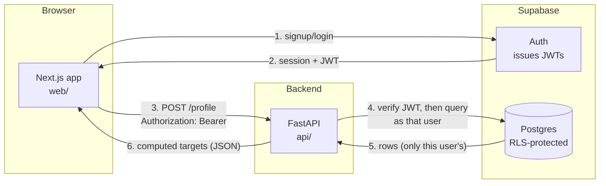

# How TruPlate AI Works — a walkthrough for a beginner

This document explains what's actually been built so far (Phases 0 to 3 of 5 — see
[project-plan.md](project-plan.md) for the full roadmap), how the pieces fit
together, and every real bug we hit while building it and why it happened.
It's written for someone who can code but hasn't necessarily used Next.js,
FastAPI, or Supabase before — new concepts are explained the first time they
show up.

If you only read one section, read **"System architecture"** and **"Setbacks
and bugs we actually hit"** — the second one is the part interviewers care
about, because anyone can show a diagram, but explaining *why* something
broke and how you found the real cause is the actual signal.

---

## 1. What this project is

TruPlate AI is a nutrition tracker. The pitch: take a photo of your meal, an
AI figures out what's on the plate, and a real nutrition database (not the AI
guessing) supplies the calorie and macro numbers. Two AI assistants ("Coach"
and "Foodie") will eventually give advice based on your actual logged
history.

**What exists right now (Phases 0 to 3):**

- *Phase 0 — foundation:* accounts, login, an onboarding wizard that computes
  your personalized calorie/protein targets, and a dashboard that shows them.
- *Phase 1 — the core loop:* photograph a meal (or describe it, or both), an
  AI identifies the foods and portions, real macro numbers come from the USDA
  database, the app asks up to three bounded questions about things that
  actually move the number (mainly hidden cooking oil), you edit anything
  that's wrong, and it's logged against today's targets.
- *Phase 2 — the Coach, and voice:* a chat assistant that answers from your
  actual logged data rather than from memory, and the ability to speak a meal
  instead of typing it.
- *Phase 3 (partly) — adaptive targets:* your calorie target stops being a
  textbook formula and starts being computed from your own weigh-ins and
  intake.

Not built yet: meal memory, the Foodie assistant, and the accuracy evaluation
suite — the rest of Phases 3 and 4.

A companion file, [WORKLOG.md](WORKLOG.md), records what was built when, and
every bug that reached committed code.

---

## 2. System architecture



Three pieces, each with one job:

- **[web/](../web/)** — Next.js. Renders pages, collects input, talks to
  Supabase directly for login/signup (that's allowed — it's not a secret),
  and talks to FastAPI for anything involving real computation or data.
- **[api/](../api/)** — FastAPI. The *only* place that holds secret API keys
  (Gemini, USDA, Supabase's service key) and the *only* place that runs
  business logic (the targets formula, later: the AI pipeline). Nothing in
  the browser ever sees a secret key — see §5.
- **Supabase** — hosted Postgres database plus an auth service. It issues
  **JWTs** (JSON Web Tokens — a signed blob proving "this request really is
  from user X," so the backend doesn't need its own login system) and
  enforces **Row Level Security**, explained in §5.

This is a fairly standard three-tier web app shape. The one TruPlate-specific
rule (from [CLAUDE.md](../CLAUDE.md)) is: **the frontend never calls Gemini or
USDA directly.** Every AI or nutrition-data call is proxied through FastAPI,
because that's the only place API keys live. This matters later — Phase 1's
photo analysis has to be a `POST /analyze` call to FastAPI, not a client-side
Gemini SDK call, even though the client-side call would be less code.

---

## 3. Walkthrough: what happens when someone uses the app today

### Sign up
[web/app/signup/page.tsx](../web/app/signup/page.tsx) calls
`supabase.auth.signUp(email, password)` directly from the browser using
[web/lib/supabase/client.ts](../web/lib/supabase/client.ts). Supabase creates
the account and (once you're logged in) hands back a **session** — an access
token (the JWT) plus a refresh token, stored in cookies by the
`@supabase/ssr` library. On success, the page redirects to `/onboarding`.

### The onboarding wizard
[web/app/onboarding/page.tsx](../web/app/onboarding/page.tsx) is a 4-step
form (goal → rate → activity → stats), each step a small function in the
same file (`GoalStep`, `RateStep`, `ActivityStep`, `StatsStep` — no separate
files, because they're small and only ever used here; splitting them out
would just be extra navigation for no benefit). State lives in one
`OnboardingState` object defined in
[web/app/onboarding/types.ts](../web/app/onboarding/types.ts), updated
through a single generic `update(key, value)` function instead of one
`setX` per field.

Two things worth understanding here:

- **Units are a display-only concern.** The app always *stores* height in cm
  and weight in kg (because that's what the Mifflin-St Jeor formula in the
  backend expects), but the UI lets you type feet/inches or pounds. The
  conversion lives in one small file,
  [web/lib/units.ts](../web/lib/units.ts), and the wizard just converts on
  the way in and out of the input field. This is the general pattern for
  "the backend wants X, the user wants to type Y": convert at the UI edge,
  keep one canonical unit everywhere else.
- **Cuisines and exclusions use the same reusable component**,
  [web/app/onboarding/ChipGroup.tsx](../web/app/onboarding/ChipGroup.tsx): a
  row of toggle buttons plus a "+ Custom" button that reveals a text input.
  Typed custom entries (e.g. an allergy not in the preset list) go into the
  same array that gets sent to the backend — so a custom exclusion is not
  just a UI label, it actually reaches the AI prompt once Phase 1 exists.

On the last step, `submit()` POSTs the whole state as JSON to
`${NEXT_PUBLIC_API_URL}/profile` with `Authorization: Bearer <access_token>`,
and redirects to `/dashboard` on success.

### The backend: turning a profile into targets
[api/main.py](../api/main.py) is the entire FastAPI app — one file, because
right now it's genuinely small (two routes). `POST /profile` and
`GET /profile` both depend on
[api/deps.py](../api/deps.py)'s `get_current_user_client`, which:

1. Reads the `Authorization: Bearer <token>` header.
2. Asks Supabase "is this token real, and whose is it?" via
   `client.auth.get_user(token)`.
3. Returns a Postgres client that's been told to act *as that user*
   (`client.postgrest.auth(token)`) — not as an all-powerful admin client.

That last point is the important one: **the backend deliberately gives up
its own power and queries the database as the logged-in user**, so Row Level
Security (§5) is a real backstop, not just decoration.

The actual math lives in [api/targets.py](../api/targets.py) — pure
functions, no database, no HTTP, nothing async. `calculate_targets()` runs
the Mifflin-St Jeor equation to get BMR (Basal Metabolic Rate — roughly, the
calories your body burns just existing), multiplies by an activity factor to
get TDEE (Total Daily Energy Expenditure — calories burned including
movement), then adds or subtracts calories based on the goal and pace
(±500 kcal/day ≈ ±1 lb/week, since a pound of fat is about 3500 kcal). This
file was built with **TDD** (test-driven development: write a failing test
first, then write the minimum code to pass it) — see
[api/tests/test_targets.py](../api/tests/test_targets.py), 7 tests covering
BMR for both sexes, the activity multiplier, both goal directions, protein
scaling, and the safe-rate cap (see §6, "the two wrong test numbers," for
a bug this actually caught).

`POST /profile` calls `calculate_targets()` and also **upserts** the raw
inputs into the `profiles` table (so they're there next time the user logs
in) — `upsert` meaning insert-or-update, so calling it twice doesn't create
a duplicate row.

### The dashboard
[web/app/dashboard/page.tsx](../web/app/dashboard/page.tsx) loads on mount,
checks for a session, calls `GET /profile`, and renders whatever the backend
computed. Three states beyond "loading": `no-profile` (new user who hasn't
finished onboarding — sent to `/dashboard` directly would otherwise just
crash or show garbage), `error`, and `ready`. The nav bar at the bottom shows
all five planned sections (Today/Log/Coach/Foodie/Profile) but only "Today"
is a real link — the rest are visibly dimmed. That's deliberate: it's honest
about what's built instead of implying features exist that don't (see
[CLAUDE.md](../CLAUDE.md)'s "errors are handled visibly" rule, applied here
to *missing* features too).

### Logging a meal (the Phase 1 core loop)

This is the part that makes it an app rather than a form. The flow lives in
[web/app/log/page.tsx](../web/app/log/page.tsx):

1. **Input.** You attach up to five photos (all of the *same* meal — different
   angles help the AI judge portions) and/or type a description. Either alone
   works. Photos are shrunk to 1024px in the browser first
   ([web/lib/image.ts](../web/lib/image.ts)) — a phone photo is several
   megabytes and no model needs that much to see a plate.
2. **Analysis.** `POST /analyze` ([api/routes/analyze.py](../api/routes/analyze.py))
   builds a prompt from *your* profile (your cuisines and exclusions get
   injected into it) and makes one Gemini call.
   [api/vision.py](../api/vision.py) forces the reply into a fixed JSON shape,
   because free-form text from an AI is not something you can build software on.
3. **Pricing.** Each identified food gets looked up in USDA
   ([api/usda.py](../api/usda.py)) and its per-100g numbers scaled to your
   actual portion. **The AI never supplies the final calorie number** — that's
   the project's central rule. If USDA has no usable match, the AI's own
   estimate is used *and visibly labelled as an estimate*.
4. **Questions.** [api/analysis.py](../api/analysis.py) turns the model's
   questions into a fixed set of options that Python knows the value of (1 tbsp
   of oil = 13.6g). You can also answer by *photographing the oil you used*.
5. **Confirm.** Edit grams, remove items, add anything missed.
   `POST /log` writes it to the database and the dashboard updates.

**Why cooking oil gets its own question.** It's the single biggest source of
error in photo-based tracking, because you cannot see oil that's already been
absorbed into food. A curry cooked with two tablespoons of ghee has ~240
calories that no photo will ever reveal. Asking one question recovers them.

**Why the fat gets added as a normal food item.** When you answer "1 tbsp", the
app doesn't apply a magic adjustment — it adds *ghee* to your meal as an
ordinary item and looks it up in USDA like anything else. That means it gets
real numbers (butter is ~717 kcal/100g, ghee ~900 — a single hardcoded value
would be wrong for one of them), and you can see and delete it like any other
food. One code path instead of two.

### Speaking a meal instead of typing it

Tap the mic on [the log page](../web/app/log/page.tsx), say what you ate, tap
stop. The recording goes to `POST /transcribe`
([api/transcribe.py](../api/transcribe.py)) and comes back cleaned up.

The important part is that it's **not plain speech-to-text**. What makes
dictation feel good isn't better hearing, it's an AI cleanup pass afterwards:

> **You say:** *"Um, I had two idlis, no wait, three idlis with, like, sambar"*
> **You get:** *"I had three idlis with sambar"*

Filler gone, and the correction resolved. Two rules keep it honest: it's told
never to invent a food that wasn't said (an invented food is calories you
never ate), and the transcript **fills the caption box rather than submitting**.
You read it before anything is analysed, so a misheard word gets caught by a
human. Transcription is also primed with the foods you log most, because
generic speech-to-text turns "idli" into "it'll".

### The Coach

[web/app/coach/page.tsx](../web/app/coach/page.tsx) is a chat, but the
interesting design is what it knows before you type.

Every message sends the model a **summary computed in SQL**: today's calories
and protein against target, what you ate, and your last 7 days. So "how many
calories do I have left?" is answered from a real database query, not from the
model counting things up. For anything deeper it can call two tools
([api/chat.py](../api/chat.py)):

- `get_logs(days)` — real per-day totals and food names
- `usda_lookup(food)` — macros for something you haven't logged

**Those tools cannot reach anyone else's data, by construction.** `get_logs`
takes only a number of days — there is no parameter for *whose* logs — and it
closes over a database connection already authenticated as you. The model
couldn't ask for someone else's rows if it tried.

Two decisions worth understanding:

- **Conversation history is capped at 20 messages.** This sounds like a
  limitation and is actually the point. A plain chatbot's memory is whatever
  fits in its context window, so your oldest data silently falls out. Here the
  durable facts arrive from SQL every turn, so the Coach's knowledge of your
  history doesn't depend on the conversation length at all.
- **"Thinking" is switched off for chat.** Gemini can reason before answering,
  which took 7.7 seconds before a single word appeared. Off, it's 0.8. Chat
  lives or dies on responsiveness, and the Coach isn't reasoning hard — the
  numbers arrive pre-computed. The photo pipeline keeps thinking on, where
  accuracy matters more than speed.

### Adaptive targets: the app learning your metabolism

The Mifflin-St Jeor formula from Phase 0 is a *population average*. Real
energy expenditure varies by a few hundred calories around it for reasons no
formula can see. After a couple of weeks you've produced better evidence:
what you ate, and what your weight did.

[api/adaptive.py](../api/adaptive.py) turns those two facts into your actual
burn. It contains no AI at all — it's arithmetic, and it's the part of this
project that most has to be provably right.

**Step 1 — smooth the noise.** Daily weight swings pounds on water and salt
alone, so raw weigh-ins are mostly noise. An *exponential moving average*
blends each reading with the running average:

```
today's_trend = 0.3 × today's_weight + 0.7 × yesterday's_trend
```

One salty dinner barely moves it; a real trend shows through within a week.

**Step 2 — work backwards from energy balance.**

```
your_burn = what_you_ate − (weight_change_in_lb × 3500 ÷ days)
```

If you ate 2500/day and *gained*, your real burn was **below** 2500. If you
lost, it was above. (A pound of body mass is about 3500 calories.)

**Step 3 — don't trust it too early.** Two weeks of data is suggestive, not
conclusive. The estimate ramps from formula to observed across weeks 2–4
rather than switching over at a threshold. In a simulation with realistic
scale noise, the two-week estimate was **351 calories wrong** and the
four-week estimate was **37 calories wrong** — which is the whole argument for
ramping.

**Three guards, each preventing a specific failure:**

- **Changes cap at 150 calories, at most once a week.** A number you plan
  meals around has to be stable; one holiday shouldn't swing it hundreds.
- **Nothing adjusts unless 70% of days were logged.** Your burn is computed
  from *logged* intake, so missing days make it look like you ate less — and
  the app would cut calories from someone who merely forgot to log. That's the
  worst mistake available to it, so it refuses and says why.
- **Every change is stored with a plain-language reason**, in an append-only
  history. A number that moves without explanation reads as a bug.

[The weigh-in page](../web/app/weight/page.tsx) charts your raw readings faint
behind the smoothed trend, because the raw line is noise and the trend is the
thing worth reacting to.

---

## 4. The database

[supabase/migrations/0001_profiles.sql](../supabase/migrations/0001_profiles.sql)
creates `profiles`, one row per user, with a `check` constraint on `goal`,
`activity_level`, and `sex` (Postgres rejects the insert at the database
level if you send a value outside the allowed set — a cheap extra
guarantee beyond whatever the API already validates). `cuisines` and
`exclusions` are Postgres text arrays (`text[]`), so a user's custom
"no cilantro" entry is just another string in the array, no separate table
needed.

[supabase/migrations/0002_meals.sql](../supabase/migrations/0002_meals.sql)
adds `meals` (one row per logged meal, with the summed totals) and
`meal_items` (one row per food in it), plus a private storage bucket for
photos. Three decisions in there worth understanding:

- **`meal_items` stores `user_id` even though it could look it up through
  `meals`.** Duplicating it lets the security policy be a simple column
  comparison instead of a subquery that runs for every row. This is normal
  practice, not sloppiness.
- **`logged_on` is the date *your device* says it is.** "Today's totals" is a
  local-calendar question, and a server in another timezone has no reliable
  way to know what day it is where you are. Rather than doing timezone maths
  (a famous source of bugs), the browser sends its own date and the server
  just filters on it.
- **Photos go straight from your browser to storage**, not through the
  backend. The rule about routing everything through FastAPI exists to protect
  *API keys*, and no key is involved here — the storage bucket's own policy
  restricts you to files under your own user ID. They upload only when you
  confirm, so abandoned analyses don't leave junk behind.

Later migrations add the rest:
[0003_chat.sql](../supabase/migrations/0003_chat.sql) stores Coach
conversations, and [0004_adaptive.sql](../supabase/migrations/0004_adaptive.sql)
adds `weights` and `targets`.

Two rules there are worth copying elsewhere. **Weigh-ins are never
overwritten** (bar re-weighing on the same day, which replaces rather than
double-counts), because the adaptive engine needs the whole series. And
**`targets` is append-only** — a change writes a new row with its reason
attached, rather than editing the old one, so you can always see the history
of why your number is what it is.

Eight tables now, every one with Row Level Security enabled the moment it was
created.

---

## 5. Security: JWTs and Row Level Security, explained

This is the section that maps directly to the "March 2026 Cal AI breach"
story in [project-plan.md](project-plan.md) — 3.2 million user records
leaked because a competitor's backend had no real per-user access control.
The mitigation here is two independent layers:

**Layer 1 — JWT verification.** Every request to a protected route must
carry a bearer token. FastAPI asks Supabase to verify it's real before doing
anything else ([api/deps.py](../api/deps.py)). A forged or expired token
gets a 401, immediately.

**Layer 2 — Row Level Security (RLS).** This is a Postgres feature, not
something the app code enforces — it's a policy attached to the *table
itself* (see the `create policy` lines in the migration file). Even if the
API code had a bug that forgot to filter `WHERE user_id = X`, Postgres would
still refuse to return another user's row, because the policy
`using (auth.uid() = user_id)` is checked by the database on every query.
The reason this only works as a real backstop is the point made above: the
backend queries *as the user* (via their JWT), not as an admin — an admin
connection bypasses RLS entirely, which would silently defeat the whole
protection.

---

## 6. Setbacks and bugs we actually hit

Everything below was found by actually running the app — signing up in a
real browser, hitting real endpoints, reading real error messages — not by
just getting the code to typecheck. Several of these would not have been
caught by types or by unit tests alone.

### `gym_days` silently discarded on every save
**Symptom:** users could set their training days in the wizard, but the
value was never in the database. **Root cause:** the FastAPI request model
(`ProfileIn` in [api/main.py](../api/main.py)) never declared a `gym_days`
field, and `create_profile` had `"gym_days": 0` hardcoded in the insert.
Pydantic (FastAPI's request-validation library) **silently drops any field
it doesn't recognize** — it doesn't error, it just ignores it. That's the
real lesson: an undeclared field isn't a loud failure, it's a silent one,
so this kind of bug won't show up in a typecheck or even in a quick manual
test unless you specifically go check the database afterward. Fixed by
declaring the field and using the real value in the insert.

### Two wrong expected values in the targets tests
While writing [api/tests/test_targets.py](../api/tests/test_targets.py),
two tests (`test_gain_goal_adds_kcal_per_rate` and
`test_lose_goal_subtracts_kcal_per_rate`) had their expected numbers
computed from raw BMR instead of TDEE (BMR × activity multiplier). Because
TDD means writing the test *before* the implementation, this was caught
immediately when the "failing" test turned out to be failing for the wrong
reason — the implementation was right and the test's expected number was
wrong. Fixed by correcting the literals to include the activity multiplier.

### Environment variables read before they were loaded
**Symptom:** the API crashed on startup with a `KeyError` for
`SUPABASE_URL`, even though it was in `.env`. **Root cause:**
[api/deps.py](../api/deps.py) reads environment variables at *import* time
(`SUPABASE_URL = os.environ["SUPABASE_URL"]` at module level), but
[api/main.py](../api/main.py) was importing `deps` *before* calling
`load_dotenv()`. Python runs module-level code the moment a file is
imported, so the order of `import` statements matters here. Fixed by
reordering `main.py` so `load_dotenv()` runs first.

### pytest tried to run a sanity script as a test
[api/scripts/test_gemini.py](../api/scripts/test_gemini.py) is a manual
sanity-check script (call Gemini once, print the result), not an automated
test — but its filename matches pytest's default `test_*.py` discovery
pattern, so `pytest` tried to run it and crashed on a missing photo file.
Fixed with [api/pytest.ini](../api/pytest.ini) (`testpaths = tests`), which
tells pytest to only look in the `tests/` folder.

### `test_meal.jpg` path resolved against the wrong directory
Related bug in the same script: it opened `"test_meal.jpg"` as a relative
path, which only works if you happen to run the script from inside
`api/scripts/`. Running it from anywhere else (e.g. the project root, or
`api/`) raised `FileNotFoundError`. Fixed with
`Path(__file__).parent / "test_meal.jpg"`, which resolves relative to the
*script's own location* regardless of the current working directory — a
general pattern worth knowing, since "works on my machine, breaks from a
different folder" is a very common bug shape.

### Two "CORS error" reports that weren't actually CORS problems
Twice during testing, the browser reported a CORS failure — once when
visiting the dashboard before finishing onboarding (a 404 case), once after
a stale session (a 401 case). **Neither was actually a CORS misconfiguration.**
The real cause: an *unhandled* Python exception (`postgrest.exceptions.APIError`
for "no row found," `supabase_auth.errors.AuthApiError` for "bad token")
was escaping the route function entirely. FastAPI's CORS middleware only
attaches CORS headers to responses it gets to handle; an unhandled exception
gets turned into a generic 500 by a different layer (Starlette's error
handler) that sits *outside* the CORS middleware, so that response has no
CORS headers at all — and a response with no CORS headers is exactly what
the browser shows as a CORS error, even though the real problem is a
missing `try/except`. Fixed by catching both exceptions and raising proper
`HTTPException`s in [api/main.py](../api/main.py) and
[api/deps.py](../api/deps.py). **The lesson:** "CORS error" in the browser
console is often a red herring — check what status code and body the server
actually sent before assuming it's a CORS config problem.

### A real race condition on logout → login
[web/app/dashboard/page.tsx](../web/app/dashboard/page.tsx)'s data loading
is a `useEffect` that does several `await`s in a row (get session, then
fetch `/profile`). If a user logs out and back in fast enough, an *old*
in-flight fetch from the previous page load could resolve *after* the new
one and overwrite the dashboard with stale data. This is a genuine
concurrency bug, not a typo — React doesn't cancel in-flight promises when
a component re-renders. Fixed with the standard pattern: a `cancelled`
boolean set to `true` in the effect's cleanup function, checked before every
`setState` call, so a late-arriving response from an old load is simply
ignored.

### Next.js 16 renamed Middleware to Proxy
Training data (and most tutorials) reference `middleware.ts` with an
exported `middleware()` function for running code on every request (used
here to keep the Supabase session cookie fresh). Next.js 16 renamed this to
`proxy.ts` / `proxy()` — same mechanics, different name. This project ships
with an `AGENTS.md` file inside `web/` specifically warning about this kind
of drift, which is how it got caught before it became a "why doesn't my
session refresh" mystery. See [web/proxy.ts](../web/proxy.ts).

### Supabase's free tier pauses your project
Partway through testing, API calls started failing with DNS errors
(`NXDOMAIN`), then briefly with 502/521 errors. Not a code bug — Supabase's
free tier auto-pauses a project after about a week of no API activity, and
a paused project's hostname temporarily stops resolving until it's manually
restored from the dashboard. Worth knowing for anyone demoing this project
after a gap: the fix is clicking "Restore" and waiting, not debugging your
own code. (For actual production hosting later, Supabase's paid tier
removes this, or a scheduled "keep-alive" ping would too.)

### Windows process management doesn't work like the usual Unix advice
Killing a stuck dev server with `lsof -ti:PORT | xargs kill` (the normal
Unix one-liner) doesn't work reliably in Windows Git Bash and repeatedly
left orphaned `uvicorn`/`next dev` processes squatting on ports, which then
caused confusing "which server actually answered this request" bugs. The
working replacement on Windows:
`netstat -ano | grep ":PORT" | grep LISTENING` to find the process ID, then
`taskkill //PID <id> //F` to kill it (note the double slashes — Git Bash's
path-mangling otherwise eats a single `-PID`).

### Choosing the wrong USDA data source (a design mistake, caught before coding)

USDA's database has several "data types". Foundation and SR Legacy are *raw
ingredients* (raw rice, butter, a raw chicken breast). Survey (FNDDS) is
*prepared dishes* — what people actually eat.

The original plan was to prefer Foundation/SR Legacy, on the reasoning that
they're the most authoritative. Testing that against the live API before
writing any code showed it was backwards: for every one of 8 test foods, the
best Foundation/SR Legacy match was **wrong**, and the FNDDS match was right.
The worst case: `sambar lentil vegetable stew` matched **"Chicken, stewing"** —
which would log meat macros for a vegetarian dish, for a user whose profile
says no seafood and South Indian. A meal photo contains *cooked dishes*, so the
"raw ingredients" table was never the right one.

**Lesson:** the plan was wrong and 10 minutes of hitting the real API caught
it. Assumptions about an external API are worth testing before building on them.

### The banana that was 4x too many calories

The very first real photo through the finished pipeline — two bananas — logged
**830 calories instead of ~214**.

The AI was not at fault; it correctly said "banana, 240g" and estimated 210
calories. The bug was in the USDA lookup: for the plain search term `banana`,
USDA ranks **"Bananas, dehydrated, or banana powder"** (346 cal/100g) *above*
**"Bananas, raw"** (89 cal/100g). Dried fruit is far denser than fresh, hence
the 4x.

This exposed a flaw in the earlier testing: the 8 foods tested above all used
descriptive multi-word searches ("idli steamed rice cake"), where USDA's
ranking is good. A single bare word like "banana" is far more ambiguous.

The fix uses information already available: **the AI's own estimate as a sanity
check on the match.** USDA's ranking is trusted by default, *unless* the top
result's calories-per-100g is more than 2x away from what the AI estimated for
the food it actually looked at — in which case the closest candidate wins.

The interesting part is what *didn't* work. Simply picking whichever USDA entry
was closest in calories fixed the banana but broke dosa, matching it to
"Crepe, chocolate filled". Relevance and calorie-plausibility each carry real
information and neither alone is enough; the working rule uses relevance as the
primary signal and calories only as a veto. Verified across 9 foods: banana
fixed, nothing else changed.

**Lesson:** an end-to-end test with real data found in one run what unit tests
with hand-picked examples had missed — because the hand-picked examples shared
a hidden property (all multi-word) that real inputs don't.

### "CORS error" again — and again it wasn't CORS

Testing the photo-answer feature in a browser produced
`blocked by CORS policy` on `/analyze/fat-photo`. Exactly like the two Phase 0
cases, it was not a CORS problem at all.

The real cause was in the server log: **Gemini returned `503 UNAVAILABLE` —
"this model is currently experiencing high demand."** That exception wasn't
caught, so it escaped as a generic 500 from a layer that sits *outside* the
CORS middleware, producing a response with no CORS headers — which the browser
reports as a CORS failure.

Rather than patching that one endpoint, the fix went to the shared choke point:
every Gemini call now goes through a single wrapper in
[api/vision.py](../api/vision.py) that converts service failures into a proper
error, so neither caller can reintroduce the bug. The user now sees "The AI
service is busy right now" with their photo and notes still on screen.

The same hole existed for USDA, which is rate-limited to 1000 requests/hour and
spends one per food — so it's a matter of *when*, not *if*. There, failing the
whole meal would be the wrong response: a USDA outage now degrades that item to
the AI's estimate (already labelled as an estimate in the UI) instead of losing
your log.

**Lesson (the third time it's come up):** "CORS error" in a browser console is
frequently a lie. Read the *server* log before touching CORS config.

### The AI writing an error message into a food name

When the fat-identification feature was given a photo with no oil in it, the
screen read: **"Found no fat detected in your photo."**

The `fat_name` field was typed as a plain string, so with no way to say "there
isn't one", the model wrote its explanation into the name field — and the UI
dutifully rendered it as though it were a food. Fixed by making the field
nullable and telling the model to return null, explicitly instructing it not to
write a sentence there. Now it reads "Couldn't spot any oil or butter in that
photo — pick an amount below."

**Lesson:** when a data model has no way to express "none", something will
express it badly. Model the absent case deliberately.

### Chasing a performance problem that wasn't there (twice)

The Coach took over 5 seconds to say its first word. Finding out why took
three attempts, two of which were wrong.

**Wrong guess #1.** I measured a database round trip at ~700ms, decided the
chat request was making six of them, and rewrote two pairs of queries into
single ones. It barely helped — because the 700ms figure came from opening a
*fresh* network connection for each measurement. Real queries, reusing an
open connection, were 50–130ms. The queries were never the problem.

**Wrong guess #2.** Measuring an endpoint over HTTP showed 2.1 seconds per
request. That turned out to be almost entirely a Windows quirk: `localhost`
resolves to an IPv6 address first, the server only listens on IPv4, and the
failed attempt has to time out before it retries. Via `127.0.0.1` the same
request took **5 milliseconds**. I had been measuring my own test script.

**The real cause**, found by finally timing each step: verifying the login
token took **1475ms**, and 900ms of that was the HTTP library building an SSL
context for a brand-new database client — on *every single request*.

Two fixes. Supabase publishes the public half of the key it signs tokens
with, so tokens are now verified locally with maths instead of by asking
Supabase over the network. And the client is reused per session rather than
rebuilt per request. **1475ms became 0.5ms**, on every authenticated page.

**Lessons:** measure before optimising, and be suspicious of your measuring
tool before your code. Both wrong guesses were plausible, and both would have
been "fixed" by shipping a change that did nothing.

### A safety cap that made things less safe

The adaptive engine is supposed to move your calorie target by **at most 150
calories per week**, so one strange week can't send it flying.

What I actually wrote capped it at 150 calories **per weigh-in**, and ran on
every weigh-in. Weigh yourself weekly and those are identical. Weigh yourself
*daily* and you get seven chances a week — the target could travel over a
thousand calories in seven days. The safety cap was doing precisely the
opposite of its job.

**Why the tests missed it:** each test asked one question — *"given this data,
what's the answer?"* — and every answer was correct. The bug isn't in any
single answer. It only exists across a *sequence*, because each answer becomes
the starting point for the next. Simulating four weeks against the real
database exposed it immediately: **14 target changes in 28 days**, where there
should have been about four.

Fixed by adjusting at most weekly and ignoring changes under 25 calories.
Afterwards it recorded 2 changes instead of 14 — and landed *closer* to the
right answer, 3 calories off instead of 21. Reacting less often made it more
accurate, because it stopped chasing noise.

**Lesson:** "at most X per week" and "at most X per event" are the same rule
only if events happen exactly once a week. Any rate limit written as a
per-call limit deserves a second look.

### A design bug caught in the mockup before it ever reached real code
While building the standalone HTML/CSS design mockup
([docs/mockup.html](mockup.html)) — used to nail down the look before
writing any React — two real bugs showed up and were fixed *there*, so they
never made it into the actual app:
- The big calorie number at the top of the dashboard card was visually
  clipped. First attempt (more padding) didn't fix it. Real cause: the
  card had `overflow: hidden` (added only to clip a decorative background
  glow effect) which was also clipping the number's own line box. Fixed by
  removing `overflow: hidden` and containing the glow a different way
  (smaller, repositioned, and layered *behind* the content instead of
  relying on clipping).
- In dark mode, some button text was invisible. Cause: `<button>` elements
  don't inherit the page's text color by default in a browser's built-in
  stylesheet — you have to say `color: inherit` explicitly, or they fall
  back to a default that doesn't track a custom dark-mode palette. Fixed
  with a small global reset (`button, input, select, textarea { color:
  inherit; font: inherit; }`).

This is why the mockup step (see §7) was worth doing separately instead of
discovering these two while also debugging real React state — cheaper to
find and fix a rendering bug in one static HTML file than in a live app.

---

## 7. From mockup to real UI

Before writing any of the onboarding or dashboard React code, the design was
built once as a single static file,
[docs/mockup.html](mockup.html) — plain HTML/CSS/JS, no framework, no
build step, open it straight in a browser. This let design decisions (sharp
rectangles instead of rounded corners, the warm color palette, the
"+ Custom" chip pattern, how an uncertain AI log should visually stand out)
get nailed down and iterated on quickly, then get carried over wholesale
into the real Tailwind CSS design tokens in
[web/app/globals.css](../web/app/globals.css) (`--bg`, `--accent`, etc.,
registered as Tailwind utility colors via `@theme inline`) and real
components. The `ChipGroup` component, the sharp-rectangle button style, and
the dark-mode-aware color tokens all trace directly back to that mockup.

**A leftover that took two rounds to get fixed:** the login and signup pages
were built *before* the mockup existed and kept plain unstyled
`border p-2 rounded` / `bg-black text-white` markup for the whole of Phase 1.
They worked, so nothing forced the issue — which is exactly how visual debt
survives. They're now one shared
[AuthForm](../web/app/AuthForm.tsx) component used by both
[login](../web/app/login/page.tsx) and
[signup](../web/app/signup/page.tsx), since the only real differences were
which Supabase call runs and where it lands afterwards.

The site root had the same shape of problem: it was still the Phase 0 API
health-check readout, so anyone visiting the site saw `API health: {"ok":true}`.
It now redirects on the server to the dashboard or the login page.

**Lesson:** "it works" is not the same as "it's finished", and nothing in a
test suite will ever tell you a page looks wrong.

---

## 8. How this was verified (not just "it typechecks")

Every feature was checked by actually driving it in a real browser with
Playwright (browser automation — small scripts that open a real Chromium
instance, click buttons, fill forms, and read back what rendered), not just by
running `tsc` or `pytest` and assuming it worked.

The Phase 0 check ran the whole loop in one script: sign up → hit `/dashboard`
early to confirm the "you haven't onboarded yet" state shows correctly →
complete the wizard → confirm the dashboard shows real computed numbers → log
out → confirm redirect to `/login` → log back in → confirm the *same* numbers
reappear (proving they persisted in the database, not just in memory) — while
watching the browser console for anything unexpected.

Phase 1 added: attach two photos → analyze → answer the oil question → edit a
portion → log → confirm the dashboard total moved. Scaling was checked
numerically rather than by eye (tripling a portion must triple its calories),
and removing the last item must *disable* logging rather than save an empty
meal.

Phase 2 needed a trick. Testing voice input properly needs someone speaking,
so Gemini's text-to-speech model was used to *generate* a sentence with filler
and a self-correction in it, which was then fed through the real transcription
pipeline. It came back cleaned correctly — a genuine test of the hardest part,
with no human in the room.

Phase 3 ran four simulated weeks of weigh-ins and meals against the real
database, which is what exposed the adaptive engine's weekly-cap bug.

This browser-driven habit is what caught nearly every real bug in this
document — `gym_days`, all three CORS-shaped failures, the 4x banana, and the
AI writing an error into a food name. **None of them would have failed a
typecheck, and most wouldn't have failed a unit test either**, because unit
tests only check the cases you already thought of.

Backend logic is covered by `pytest` — **109 tests passing** across ten files:
the targets maths, the adaptive engine, USDA matching and scaling, the AI
response schema and its retry/outage handling, the clarifying-answer
arithmetic, the Coach's context and tools, and voice transcription. See
[WORKLOG.md](WORKLOG.md) for the per-file breakdown.

**The whole suite runs offline and needs no credentials.** USDA responses are
saved fixtures and every AI call is faked, so it can't fail because someone
else's server is down — and it will run in CI without secrets when Phase 4
adds one.

Phase 1 verification went further than the browser, because the security
claims deserve proof rather than assertion: a script created two accounts,
logged a meal as the first, then confirmed the second could see **zero** of its
meals and got an error trying to read its photo. It also confirmed the server
ignores a client that lies about its own calorie total, and rejects a photo
path belonging to another user.

---

## 9. Current status and what's next

**Done (Phase 0 — foundation):** repo structure, Next.js + FastAPI talking
over CORS, Supabase email auth, secrets kept server-side and gitignored,
Gemini/USDA sanity scripts (prove the API keys work at all, before building
a real pipeline on top), `profiles` table with RLS, the onboarding wizard,
the deterministic targets engine with unit tests, and a dashboard that shows
real persisted data.

**Done (Phase 1 — the core loop):** `POST /analyze` handling photos, text, or
both; USDA lookup with the calorie sanity check; bounded clarifying questions
answerable by tap or by photographing the oil; a confirm screen with full item
editing; `POST /log`; and a dashboard showing today's real totals against your
targets. 48 unit tests, plus browser and live-API verification.

Verified end to end: two photos of one meal → correctly identified without
double-counting → 1 tbsp of ghee added as 119 calories of real USDA "Ghee,
clarified butter" → portion edited → logged → dashboard updated. A second user
account confirmed it can see **none** of the first user's meals or photos.

**Done (Phase 2 — the Coach and voice):** `POST /chat` streaming word by word
with tool calling, conversations persisted, and voice meal logging with the
transcribe-and-clean pass. Verified live: the Coach quoted real logged numbers
and named the actual foods eaten, deferred a medical question to a doctor, and
a second account could read none of the first's conversation.

**Done (Phase 3, partly — adaptive targets):** the weigh-in page with its
trend chart, and the engine that recomputes your calorie target from your own
data. Verified against four simulated weeks: it estimated a burn of 2721
against a true 2700, and moved the target to within 3 calories of ideal.

**Next:** meal memory — confirmed meals get embedded so a re-scan recognises
them and offers your own corrected numbers in one tap. Then the recipe corpus,
then the Foodie assistant on top of both. Foodie is deliberately last: its
useful features depend on that corpus, so building it now would mean building
it twice.

Then Phase 4: an accuracy evaluation suite, rate limiting, Docker and CI, and
deployment.

### Known limitations, stated plainly

- **Portion estimates from a photo are roughly ±20–30%.** No amount of
  engineering fixes that; it's why the app leans on trends over time and makes
  editing easy rather than claiming precision it doesn't have.
- **USDA doesn't contain every food.** It has no *poha* (flattened rice), so it
  returns a groundcherry entry that happens to share the word — and the calorie
  sanity check can't catch that one, because the wrong answer is calorically
  plausible. The current defence is showing you the matched USDA description so
  you can spot it. A per-user alias table is the planned fix.
- **Nothing verifies that a page *looks* right.** Every visual bug in this
  document was found by a human looking at a screenshot. Automated checks
  confirm behaviour, not appearance.
- **Both free tiers are real constraints.** Gemini's daily limit ran out twice
  during a single session of testing, and Supabase pauses a project that sits
  idle for about a week — which turns a shared link into a dead one. Both need
  answering before this is deployed anywhere a stranger might click it.
- **The Coach's medical guardrail is a prompt instruction**, which is weaker
  than enforcing something in code. It mostly talks rather than recommending
  specific foods, so the exposure is smaller — but that's a difference in kind,
  not a claim that the two are equivalent.
- **It isn't deployed.** Everything above runs on one laptop.
