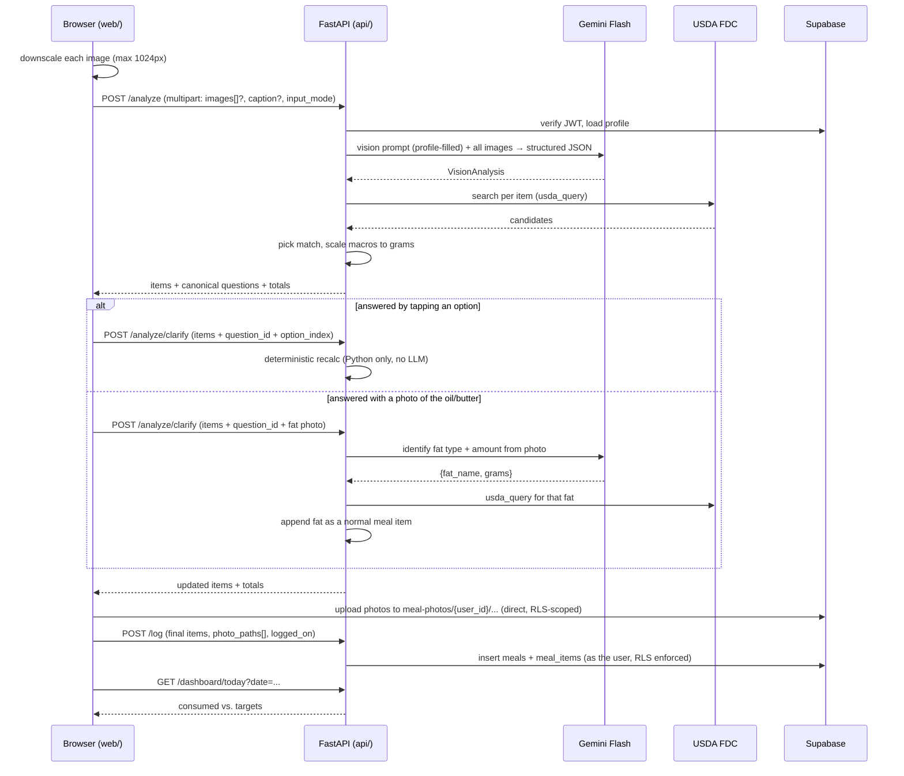

# Phase 1 — Core Loop Design

**Date:** 2026-07-24
**Status:** Approved design, ready for implementation planning
**Goal:** Photo/text/photo+text → Gemini identifies foods → USDA supplies real macro numbers → bounded clarifying questions → user confirms/edits → meal is logged → dashboard shows today's totals against targets.

**Exit criteria** (from `docs/project-plan.md` §5): photograph lunch → answer one ghee question → see logged macros. Plus: text-only and photo+text modes work through the same pipeline; `pytest` green.

---

## 1. Correction to a pre-design decision (read this first)

During design I recommended, and we agreed on, "**prefer Foundation/SR Legacy data types, take the top result**" for USDA matching. **That recommendation was wrong**, and I confirmed it against the live USDA API before writing this spec.

USDA FoodData Central has four data types. Foundation and SR Legacy are *raw ingredients* (raw rice, butter, chicken breast). `Survey (FNDDS)` is *what people actually eat* — prepared, composite dishes. A meal photo contains prepared dishes, so filtering to Foundation/SR Legacy systematically selects the wrong food.

Measured across 8 representative queries — for every single one, the best Foundation/SR Legacy match was wrong and the best FNDDS match was right:

| `usda_query` | Best Foundation/SR Legacy | Best Survey (FNDDS) |
|---|---|---|
| dosa rice crepe potato filling | Dumpling, potato- or cheese-filled, frozen ❌ | Dosa, with filling ✅ |
| sambar lentil vegetable stew | **Chicken, stewing, meat and skin** ❌ | Sambar, vegetable stew ✅ |
| coconut chutney | Flour, coconut ❌ | Chutney ✅ |
| idli steamed rice cake | Rice, white, steamed, Chinese restaurant ❌ | Idli ✅ |
| chipotle burrito bowl chicken | TACO BELL, BURRITO SUPREME ❌ | Burrito bowl, chicken ✅ |
| butter chicken curry | Spices, curry powder ❌ | Chicken curry ✅ |
| chicken breast grilled | Chicken, broiler, skinless, boneless ~ | Chicken breast, grilled with sauce ✅ |
| white rice cooked | Rice, white, glutinous, cooked ~ | Rice, white, cooked, glutinous ~ |

The sambar row is the alarming one: the rejected strategy would have logged **chicken macros for a vegetarian lentil stew** — wrong numbers *and* a food-exclusion violation, for the exact cuisine this app's first user eats.

Also measured: **USDA's own relevance ranking put the correct food at #1 in all 8 cases.** The data-type filter was actively destroying a ranking that was already right.

**Corrected decision:** take USDA's top-ranked result, excluding only `Branded` (specific commercial products — noisy for generic dish identification). No preference ordering beyond that. This is both more accurate *and* less code than what we agreed on.

**Amended after live testing (see §1a).** Ranking alone proved insufficient for bare one-word queries, so a sanity check was added.

### 1a. Amendment: the energy sanity check

The first real photo through the finished pipeline — two bananas — logged **830 kcal instead of ~214**. USDA ranks `Bananas, dehydrated, or banana powder` (346 kcal/100 g) above `Bananas, raw` (89) for the bare query `"banana"`. USDA's ranking is reliable for the descriptive multi-word queries measured in §1 ("idli steamed rice cake") but not for short ones.

Notably the vision model's *own* estimate was correct (~87 kcal/100 g). So the model's estimate is now used as a **sanity check on the match**, not as a number: USDA's ranking wins unless the top hit's energy is more than **2×** away from what the model estimated for the food it actually saw, in which case the closest-energy candidate among the top 10 is taken instead.

Ranking has to stay primary — ranking purely by energy agreement was measured to pick `Crepe, chocolate filled` over `Dosa, with filling`. Measured across 9 queries, the hybrid fixes banana and changes nothing else (correct matches sat at 1.0–1.4× ratios; the banana mismatch was 3.9×).

This does not weaken invariant #1: the estimate only chooses *between USDA rows*, which is identification. Every logged number still comes from USDA.

**A second finding:** USDA's `dataType` query parameter **cannot be used** to filter server-side. Passing `dataType=Survey (FNDDS)` returns `400 Bad Request` from their nginx — the URL-encoded parentheses (`%28`/`%29`) are rejected before reaching the application. Filtering must happen client-side in Python over an unfiltered result page. This is a real API defect worth a code comment so nobody "fixes" it back later.

---

## 2. Architecture and data flow



Invariants this preserves (from `CLAUDE.md`): the LLM never supplies final macro numbers (#1); all AI/USDA/secret calls are server-side (#2); every new table has `user_id` + RLS at creation (#3); Gemini calls are stateless (#4); clarifying recalcs are deterministic Python (#10).

---

## 3. Backend modules

### `api/usda.py`

```python
search_food(query: str, page_size: int = 25) -> list[dict]
pick_best_match(results: list[dict]) -> dict | None   # first non-Branded, else None
macros_for_grams(food: dict, grams: float) -> Macros  # scale per-100g by grams/100
```

FNDDS/Foundation/SR Legacy nutrients in the search response are **per 100 g**, with stable numeric nutrient IDs — match on ID, not name, since names vary (`Energy` appears in both kcal and kJ rows):

| ID | Nutrient | Unit |
|---|---|---|
| 1008 | Energy | KCAL |
| 1003 | Protein | G |
| 1005 | Carbohydrate, by difference | G |
| 1004 | Total lipid (fat) | G |

Verified live: Idli = 128 kcal / 6.36 g protein per 100 g; Sambar = 86 kcal / 4.33 g protein per 100 g. Both realistic.

If a nutrient ID is absent from a match, that macro is `None` rather than silently `0` — a missing value and a true zero are different facts, and silently coercing to zero would under-report calories.

**Fallback chain per item:** USDA match → `source: "usda"`. No match (or no energy value) → the model's own `llm_estimate` → `source: "llm"`, surfaced in the UI as an estimate, per invariant #1.

### `api/vision.py`

Pydantic models mirroring `docs/vision-prompt.md`'s schema exactly: `Portion`, `LlmEstimate`, `VisionItem`, `ClarifyingQuestion`, `VisionAnalysis`.

`build_prompt(profile) -> str` fills `{{cuisines}}` and `{{exclusions}}` from the profile row. `{{frequent_restaurants}}` and `{{known_meals}}` are filled with `"(none yet)"` — both are derived from meal history that doesn't exist until Phase 3. The prompt degrades safely: with no known restaurants it asks the hidden-fat question more often, which is the conservative default.

`analyze_meal(prompt, images: list[tuple[bytes, str]] = []) -> VisionAnalysis` — one stateless `google-genai` call carrying **all** photos of the meal. Two SDK details confirmed against the installed version (2.10.0):

- In-memory images use `types.Part.from_bytes(data=..., mime_type=...)` — no temp file, no Files API upload, so nothing touches disk. Multiple images are just multiple parts in one `contents` list; Gemini is natively multi-image.
- `GenerateContentConfig(response_mime_type="application/json", response_schema=VisionAnalysis)` makes Gemini enforce our schema server-side, and `response.parsed` returns the typed object.

**Multiple photos of one meal** (different angles, or a close-up of one dish) improve portion estimation, which is the pipeline's weakest link. This needs an explicit prompt rule, because the obvious failure mode is the model reporting two dosas when it sees two photos of one dosa:

> The photos all show THE SAME meal from different angles or distances. Identify each distinct food ONCE — never multiply portions by the number of photos. Use the extra angles to refine portion estimates and to resolve items obscured in another shot.

This changes the prompt template, so `docs/vision-prompt.md` (the source of truth for the prompt) must be updated in the same commit — flagged here per `CLAUDE.md`'s rule against letting code and docs drift apart silently.

Schema-enforced output makes malformed responses rare but not impossible (truncation, safety refusal). The **required retry path stays**: on `ValidationError`, retry once with the validation error appended to the prompt; on a second failure raise, and the route returns `502` with a clear message.

### Clarifying questions — deterministic by construction

The LLM decides **whether** to ask and **which items** are affected. Python owns **what the options are and what they're worth.** For questions where `reason` is `hidden_fat` or `portion`, the LLM's free-text `options` array is **replaced** with a canonical set defined in Python:

```python
FAT_OPTIONS  = [("none", 0.0), ("1 tsp total", 4.5), ("1 tbsp total", 13.6), ("2+ tbsp total", 27.2)]  # grams of added fat
PORTION_OPTIONS = [("about half", 0.5), ("as estimated", 1.0), ("about 1.5x", 1.5), ("about double", 2.0)]  # gram multiplier
```

The frontend returns an **option index**, not a string — so `POST /analyze/clarify` never parses natural language, and the recalculation is pure arithmetic. No second Gemini call, satisfying invariant #10.

**Cooking fat is modelled as a normal meal item, not as a special adjustment.** Answering the hidden-fat question appends an item (`name: "ghee"`, `grams: 13.6`, `source: "user"`) that flows through the *same* USDA mapping every other item uses. This is one code path instead of two, it gets real USDA numbers for the fat instead of a hardcoded 9 kcal/g (butter is ~717 kcal/100 g vs ghee ~900 — they are not interchangeable), and the fat shows up as a visible line item the user can edit or delete like anything else. `PORTION_OPTIONS` stays a pure multiplier on an existing item's grams.

`kcal_impact` is **computed in Python** from the canonical options rather than trusting the LLM's estimate string, so the number shown to the user is the number that will actually be applied.

This keeps `docs/vision-prompt.md`'s published schema unchanged — the LLM still emits `options: string[]` as documented; Python simply overrides them. No doc/code conflict.

### Answering the fat question with a photo

Tappable options rely on the user remembering how much oil went in the pan, which is exactly the estimate people are worst at — and hidden fat is the single largest documented error source this app is designed against (`project-plan.md` §2). So a hidden-fat question can **also** be answered by attaching a photo of the oil/ghee/butter used: the bottle, the jar, or (better) the spoon or pan.

`POST /analyze/clarify` accepts an optional image alongside the answer. When present, it makes one small, stateless Gemini call with a narrow schema:

```python
class FatAnswer(BaseModel):
    fat_name: str            # "ghee", "olive oil", "butter" -> becomes the usda_query
    grams: float | None      # null when the photo shows the type but not the amount
    confidence: float
```

The result becomes a fat item through the ordinary USDA path. If `grams` is `None` (a photo of a ghee jar shows *what* but not *how much*), the canonical amount options stay on screen — now correctly priced for the identified fat rather than a generic default. That fallback is required, not polish: without it the app would have to invent a quantity it cannot see.

**This does not violate invariant #10.** The LLM identifies *what fat and how much* — identification and portion, its job under invariant #1. Python still computes every calorie, from USDA. `project-plan.md` §3.3.6 explicitly sanctions this: *"A follow-up LLM call happens only when the answer changes identification itself."* A photo of the oil does exactly that.

**Questions we do not generate in Phase 1:** `low_confidence` and `exclusion_conflict` change *identification*, not arithmetic, which per `project-plan.md` §3.3.6 would need a follow-up LLM call. Instead these surface as **prominent warnings on the confirm screen**, where full item editing (§5) already lets the user fix the identification directly. This is deliberate scope: it satisfies the exclusion-misidentification intent without building a second LLM round-trip.

### Routes (`api/main.py`)

| Route | Purpose |
|---|---|
| `POST /analyze` | multipart (`images[]?`, `caption?`, `input_mode`) → items + questions + totals. At least one image or a caption required (invariant #7: caption is never mandatory). |
| `POST /analyze/clarify` | current items + `question_id` + (`option_index` \| fat photo) → updated items + totals. Pure Python unless a photo is attached. |
| `GET /usda/search?query=` | top non-Branded candidates with per-100 g macros, for the add/rename-item flow. |
| `POST /log` | final items + `photo_paths[]` + `logged_on` → writes `meals` + `meal_items`. |
| `GET /dashboard/today?date=` | today's consumed totals vs. targets. |

`main.py` is currently one file with two routes; adding five more plus their request models makes it too big to hold in one read. Split routes into `api/routes/` (`profile.py`, `analyze.py`, `meals.py`) mounted via `APIRouter`, keeping `main.py` as app setup + middleware only. This is a targeted improvement to code being actively worked in, not unrelated refactoring.

**Trust boundary:** `/log` recomputes meal totals server-side by summing the submitted items. Client-sent totals are ignored — a client is not a trusted source of arithmetic.

---

## 4. Data model — migration `0002_meals.sql`

```sql
meals(
  id uuid pk, user_id uuid not null references auth.users on delete cascade,
  logged_at timestamptz default now(),
  logged_on date not null,              -- client's LOCAL date; see timezone note
  input_mode text check (input_mode in ('photo','text','photo_text')),
  photo_paths text[] not null default '{}', caption text,
  status text default 'confirmed' check (status in ('confirmed','draft','failed')),
  kcal numeric, protein_g numeric, carbs_g numeric, fat_g numeric,
  analysis_json jsonb                   -- raw vision response, for debugging + Phase 4 evals
)

meal_items(
  id uuid pk, meal_id uuid references meals on delete cascade,
  user_id uuid not null,                -- denormalized; see RLS note
  name text, grams numeric, count numeric, unit text,
  source text check (source in ('usda','llm','user')),
  usda_fdc_id int, usda_description text,
  kcal numeric, protein_g numeric, carbs_g numeric, fat_g numeric,
  confidence numeric
)
```

Both tables get RLS enabled at creation with select/insert/update/delete policies on `auth.uid() = user_id` (invariant #3).

**`user_id` on `meal_items` is denormalized on purpose.** The alternative is an RLS policy with an `EXISTS` subquery against `meals`, which runs per row on every query. A direct column makes the policy a simple column comparison — this is the standard Supabase pattern for child tables and the performance difference is real at scale.

**Timezone (`logged_on`):** "today's totals" is a local-calendar question, and the server has no reliable idea what day it is for the user. Rather than doing timezone math server-side, the client sends its own local date at log time and `GET /dashboard/today` filters `where logged_on = $date`. Simple, correct, no timezone library.

**Storage:** private bucket `meal-photos`, path `{user_id}/{uuid}.jpg`, with a policy scoping access to `(storage.foldername(name))[1] = auth.uid()::text` — i.e. a user can only touch objects under their own UUID prefix.

Photos upload **directly from the browser to Supabase Storage**, not proxied through FastAPI — this is an RLS-scoped call, not a secret-bearing one, so it doesn't need the backend (invariant #2 is about API keys, and no key is involved). Upload happens **on confirm only**, so abandoned or retried analyses never leave orphaned objects.

`photo_paths` is a `text[]` rather than a `meal_photos` child table: Phase 1 needs no per-photo metadata, and the codebase already uses `text[]` for `cuisines`/`exclusions`. A photo attached to answer the fat question is stored in the same array — which photo answered which question isn't information anything reads back in Phase 1.

Not built in Phase 1 (Phase 2/3 per phase discipline): `meal_embeddings`, `conversations`, `messages`, `recipes`, `weights`, `targets` history.

---

## 5. Frontend

**New route `/log`:**
- **Multi-photo input** with `capture="environment"` (opens the rear camera on mobile), and/or a caption textarea. Either alone works, or both together — one code path, `input_mode` derived from what's present. Selected photos show as a thumbnail strip with a remove button on each and an "add another" tile, so a user can shoot the plate, then a close-up of one dish, then send both.
- Client-side downscale to max 1024px via canvas before use. The same downscaled blobs are sent to `/analyze` and later uploaded to Storage — meal photos need no more resolution than that for either Gemini or storage, and it makes both transfers cheap on cell data. This matters more with several photos per meal.

**Results screen:** items with USDA-grounded macros, each showing its source (USDA description, or a visible "AI estimate" badge for `source: "llm"`). Low-confidence items and any exclusion warnings are made **visually obvious** — carrying over the mockup feedback that uncertainty must be easy to spot and click into, rather than buried. Clarifying questions render as tappable option buttons; tapping calls `/analyze/clarify` and updates totals in place.

Hidden-fat questions additionally offer **"or photograph what you used"** next to the options — opening the camera, sending the shot to `/analyze/clarify`, and adding the identified fat as a line item. When the photo identifies the fat but not the amount, the amount options remain on screen, relabelled for the specific fat found.

**Confirm screen — full editing** (per the agreed decision): adjust grams per item (macros recompute live from the same per-100 g data), remove an item, rename an item (re-runs `/usda/search`), and add a missed item by free text (search → pick a USDA match → add). Submit uploads the photo, calls `/log`, redirects to the dashboard.

**Dashboard:** replaces the "meal logging isn't built yet — that's Phase 1" placeholder with real consumed-vs-target numbers and remaining budget for the day. The "Log" nav item goes from inert to a real link.

**Failure handling** (`CLAUDE.md`: a failed analysis must never silently drop a meal): a `502` from `/analyze` shows a visible error card and **keeps the draft** (photo + caption stay in component state) with a retry button. Nothing is cleared on failure. Phase 1 does not write `status='failed'` rows — the draft lives client-side; the column exists for when Phase 3 adds server-side drafts.

---

## 6. Testing

Unit tests written **with** each feature, not after:

- `api/tests/test_usda_mapping.py` — `pick_best_match` excludes Branded and respects USDA rank; `macros_for_grams` scaling arithmetic; missing-nutrient → `None`, not `0`. Fixtures are captured real USDA responses, so tests don't hit the network.
- `api/tests/test_clarify.py` — fat-option grams across all four options, the appended fat item priced from USDA (not a hardcoded 9 kcal/g), portion multipliers, `kcal_impact` computation, and the photo-answer path with `grams: None` falling back to the amount options instead of inventing a quantity.
- `api/tests/test_vision.py` — `VisionAnalysis` validation accepts the documented example from `vision-prompt.md`; malformed output triggers exactly one retry then fails cleanly; multiple images become multiple parts in a single call (Gemini mocked — no API calls in the test suite).

Named `test_usda_mapping.py`, not `test_usda.py`, to avoid colliding with the existing sanity script `api/scripts/test_usda.py`.

Verification beyond tests: run the real flow in a browser (photo → questions → edits → logged → dashboard totals), per the Phase 0 practice that caught the bugs unit tests didn't.

---

## 7. Explicitly out of scope for Phase 1

Voice input, Coach/Foodie assistants, meal memory / embeddings, adaptive TDEE, recipe RAG, restaurant search, rate limiting, and the eval suite. These are Phases 2–4 and must not be built ahead (`CLAUDE.md` phase discipline).

Exclusion **hard-filtering** (invariant #5) is a Phase 2 concern — it governs filtering *recommendations*, which don't exist yet. Phase 1's exclusion handling is the prompt-level misidentification check already specified in `vision-prompt.md`, surfaced as a confirm-screen warning.

---

## 8. Known risks

- **USDA is weak on regional composites.** FNDDS covers South Indian staples better than expected (idli, dosa, sambar all matched correctly), but coverage will be uneven. The `llm_estimate` fallback plus visible sourcing keeps this honest rather than silently wrong; a custom-foods table is the Phase 3+ mitigation if it proves necessary.
- **Portion estimation from a photo is genuinely hard** (±20–30% per `project-plan.md` §4.7). The design's answer is transparency, not false precision: show confidence, show the source, make editing easy.
- **Gemini schema enforcement is not a guarantee.** The retry-then-fail-visibly path is the backstop, and it is tested.
